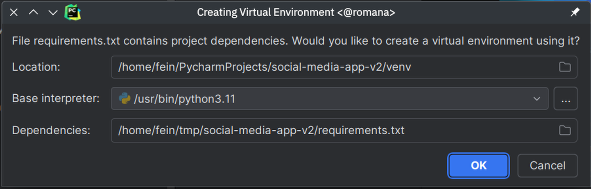
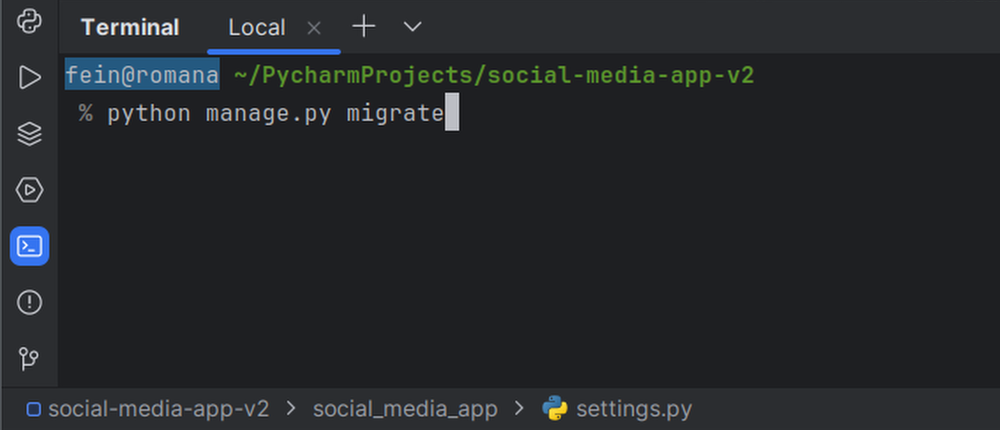
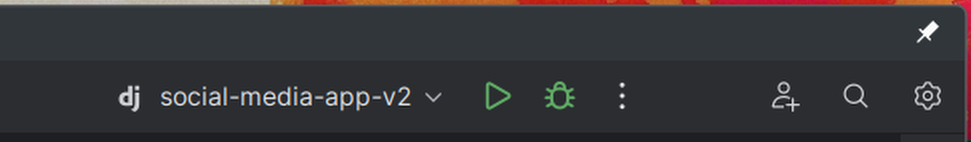

# Social Media App

## Setup

1. Beim ersten Öffnen in PyCharm Professional sollte es automatisch ein „Virtualenv“ einrichten.
    Nach okay dauert es ein bisschen, bis alles notwendige runtergeladen und eingerichtet ist.

    

2. Vor dem ersten Start muss nun die Datenbank initialisiert werden.
    Das Terminal kann unten rechts aufgemacht werden.

    Dort die Datenbank mit
    ```bash
    python manage.py migrate
    ```
   anlegen.

   

3. Eigentlicher Start der App dann oben rechts mit dem grünen Dreieck:

    

    Im Browser ist die App nun unter http://localhost:8000 erreichbar.
    Nach Änderungen im Code reicht es aus die Seite neu zu laden.
    Die App muss *nicht* neu gestartet werden.
